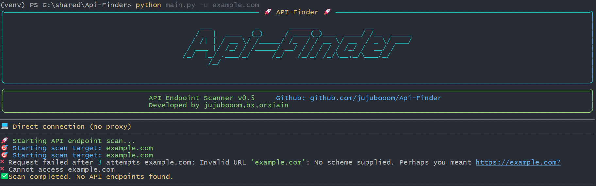

# Api-Finder-强大的Api寻找工具

[](https://www.python.org/downloads/)
[](https://github.com/jujubooom/api-finder/blob/master/LICENSE)
[](https://github.com/jujubooom/api-finder/releases)
[](https://github.com/jujubooom/api-finder)
[](https://github.com/jujubooom/api-finder)

🔍 **Api-Finder是一款功能强大的API端点发现工具** 📝[English Document](https://github.com/jujubooom/api-finder/blob/master/docs/README.md)



## 🚀上手指南

📢 请务必花一点时间阅读此文档，有助于你快速熟悉Api-Finder！

<details>
<summary><b>🐍安装要求</b></summary>

Api-Finder基于[Python 3.7+](https://www.python.org/downloads/)开发和测试，需要Python 3.7或更高版本才能运行。
安装Python环境可以参考[Python安装指南](https://www.python.org/downloads/)。运行以下命令检查Python和pip版本：
```bash
python -V
pip -V
```
如果你看到类似以下的输出便说明Python环境没有问题：
```bash
Python 3.8.0
pip 20.2.0 from /usr/local/lib/python3.8/site-packages/pip (python 3.8)
```
</details>

<details>
<summary><b>✔安装步骤</b></summary>

1. **下载项目**

```bash
git clone https://github.com/your-username/api-finder.git
cd api-finder
```

2. **安装依赖**

```bash
# 安装基础依赖
pip install -r requirements.txt

# 可选：如果需要Excel输出格式，请安装
pip install openpyxl

# 验证安装
python main.py --help
```

3. **更新项目**

```bash
git pull origin master
```
</details>

<details>
<summary><b>✨使用演示</b></summary>

基本使用示例：
```bash
# 扫描单个网站
python main.py -u https://example.com

# 使用Cookie进行认证扫描
python main.py -u https://example.com -c "session=abc123"

# 输出结果到文件
python main.py -u https://example.com -o results.txt

# 使用代理
python main.py -u https://example.com -p socks5://127.0.0.1:1080

# 静默模式（只输出发现的API）
python main.py -u https://example.com -s
```

高级使用示例：
```bash
# 详细输出模式
python main.py -u https://example.com -v

# 随机User-Agent
python main.py -u https://example.com -r

# 指定设备类型的User-Agent
python main.py -u https://example.com -a phone    # 手机UA
python main.py -u https://example.com -a weixin   # 微信UA

# 自定义超时和延迟
python main.py -u https://example.com -t 30 -d 1.0

# 强制更新规则文件
python main.py -u https://example.com -U

# 多种输出格式
python main.py -u https://example.com -o results.json    # JSON格式
python main.py -u https://example.com -o results.html    # HTML报告
python main.py -u https://example.com -o results.csv     # CSV表格
python main.py -u https://example.com -o results.xml     # XML格式
python main.py -u https://example.com -o results.xlsx    # Excel表格
python main.py -u https://example.com -o results.md      # Markdown格式
```

</details>

<details>
<summary><b>🧐结果说明</b></summary>

Api-Finder在扫描完成后会生成相应的结果文件：

- **TXT格式**: 纯文本格式，包含所有发现的API端点
- **JSON格式**: 结构化数据，便于程序处理
- **CSV格式**: 表格格式，可用Excel打开
- **HTML格式**: 美观的网页报告，包含详细信息
- **XML格式**: 标准XML格式，便于系统集成
- **Excel格式**: 电子表格格式，支持多工作表
- **Markdown格式**: 文档格式，便于阅读和分享

扫描结果包含以下信息：
- API端点URL
- HTTP方法（GET、POST、PUT、DELETE等）
- 响应状态码
- 响应时间
- 响应头信息
- 响应体大小
- 发现时间戳

</details>

<details>
<summary><b>🤔使用帮助</b></summary>

**命令行参数说明**

```bash
python main.py --help
```

主要参数：
- `-u, --url`: 目标网站URL（必需）
- `-c, --cookie`: 认证Cookie
- `-p, --proxy`: 代理设置
- `-o, --output`: 输出文件路径
- `-s, --silent`: 静默模式
- `-v, --verbose`: 详细输出
- `-r, --random-ua`: 随机User-Agent
- `-a, --user-agent`: 指定User-Agent类型
- `-t, --timeout`: 请求超时时间
- `-d, --delay`: 请求延迟时间
- `-U, --update-rules`: 更新规则文件

**配置文件说明**

Api-Finder使用YAML格式的配置文件来定义扫描规则，配置文件位于`config/rules.yaml`，你可以根据需要修改扫描规则。

**代理设置**

支持多种代理模式：
- HTTP代理：`http://127.0.0.1:8080`
- HTTPS代理：`https://127.0.0.1:8080`
- SOCKS5代理：`socks5://127.0.0.1:1080`

</details>

## 🎉项目简介

项目地址：[https://github.com/jujubooom/api-finder](https://github.com/jujubooom/api-finder)

在Web安全测试和API开发中，发现和识别API端点是非常重要的环节。目前市面上虽然有一些API发现工具，但往往存在以下问题：

* **功能单一**，只能进行基本的端点发现，缺乏深度分析和验证功能。
* **兼容性差**，对现代Web框架和SPA应用支持不足。
* **输出格式有限**，结果难以进一步处理和分析。
* **性能问题**，没有利用异步和多线程技术，扫描速度较慢。

为了解决以上痛点，Api-Finder应运而生，正如其名，我们希望Api-Finder是一款功能全面、性能优秀的API端点发现工具🔍。

目前Api-Finder还在持续开发中，肯定有不少问题和需要改进的地方，欢迎各位大佬提交[Issues](https://github.com/jujubooom/api-finder/issues)和[PR](https://github.com/jujubooom/api-finder/pulls)，用着还行给个小星星✨吧。

## 👍功能特性

* **强大的发现能力**
  - 自动解析HTML页面中的API端点
  - 支持JavaScript文件中的API端点发现
  - 识别常见的API路径模式
  - 支持RESTful API端点发现
  - 自动识别GraphQL端点

* **灵活的配置选项**
  - 支持自定义扫描规则
  - 可配置的User-Agent
  - 多种代理模式支持
  - 可调节的请求参数
  - 灵活的过滤规则

* **丰富的输出格式**
  - 支持TXT、JSON、CSV、HTML、XML、Excel、Markdown等多种格式
  - 美观的HTML报告
  - 结构化的JSON输出
  - 便于分析的CSV格式

* **优秀的用户体验**
  - 美观的命令行界面
  - 实时进度显示
  - 详细的日志输出
  - 友好的错误提示
  - 多语言支持

* **高性能设计**
  - 异步HTTP请求
  - 多线程处理
  - 智能请求限流
  - 内存优化
  - 快速响应

* **安全特性**
  - 支持认证Cookie
  - 代理匿名化
  - 请求头随机化
  - 防检测机制
  - 安全扫描模式

如果你有其他很棒的想法请务必告诉我！😎

## 🌲目录结构

```
Api-Finder/
├── apifinder/              # 核心源代码包
│   ├── __init__.py        # 包初始化文件
│   ├── apifinder.py       # 主程序逻辑
│   ├── config.py          # 配置模块
│   ├── FileOutputManager.py # 文件输出管理
│   ├── Output_Manager.py  # 输出管理器
│   ├── i18n.py            # 国际化模块
│   ├── ua_manager.py      # 用户代理管理器
│   └── utils.py           # 工具函数
├── config/                 # 配置文件目录
│   └── rules.yaml         # 扫描规则配置
├── docs/                   # 文档目录
│   ├── README.md          # 英文文档
│   └── README_CN.md       # 中文文档
├── tests/                  # 测试目录
│   └── __init__.py
├── main.py                 # 主入口文件
└── requirements.txt        # 项目依赖
```

更多信息请参阅[目录结构说明](https://github.com/jujubooom/api-finder/tree/master/docs/directory_structure.md)。

## 👏用到框架

* [requests](https://github.com/psf/requests) - 优雅的HTTP库
* [beautifulsoup4](https://pypi.org/project/beautifulsoup4/) - HTML/XML解析库
* [rich](https://github.com/Textualize/rich) - 美观的命令行界面库
* [pyfiglet](https://github.com/pwaller/pyfiglet) - ASCII艺术字体库
* [PyYAML](https://pyyaml.org/) - YAML配置文件处理

感谢这些伟大优秀的Python库！

## 🔖版本控制

该项目使用[SemVer](https://semver.org/)语义化版本格式进行版本管理，你可以参阅[变更记录说明](https://github.com/jujubooom/api-finder/tree/master/docs/changes.md)了解历史变更情况。

## ⌛后续计划

- [ ] 支持更多API端点发现模式
- [ ] 添加API端点验证功能
- [ ] 实现Web界面
- [ ] 支持更多输出格式
- [ ] 优化性能和稳定性
- ...

更多信息请参阅[后续开发计划](https://github.com/jujubooom/api-finder/tree/master/docs/todo.md)。

## 🙏贡献

非常热烈欢迎各位大佬一起完善本项目！

## 👨‍💻贡献者

* **[Ewoji's Blog](https://ewoji.cn/)**
  * 项目开发

* **[Orxiain's Blog](https://orxiain.life/)**
  * 项目开发

* **[Bx's Blog](https://www.bx33661.com/)**
  * 项目开发

希望你们参与进来


## 📄版权

该项目签署了MIT授权许可，详情请参阅[LICENSE](https://github.com/jujubooom/api-finder/blob/master/LICENSE)。

## 😘鸣谢

感谢网上开源的各个API发现项目！

感谢所有为这个项目做出贡献的开发者！

## 📜免责声明

本工具仅能在取得足够合法授权的企业安全建设中使用，在使用本工具过程中，您应确保自己所有行为符合当地的法律法规。 
如您在使用本工具的过程中存在任何非法行为，您将自行承担所有后果，本工具所有开发者和所有贡献者不承担任何法律及连带责任。
除非您已充分阅读、完全理解并接受本协议所有条款，否则，请您不要安装并使用本工具。
您的使用行为或者您以其他任何明示或者默示方式表示接受本协议的，即视为您已阅读并同意本协议的约束。

## 💖Star趋势

[](https://www.star-history.com/#jujubooom/Api-Finder&Date)